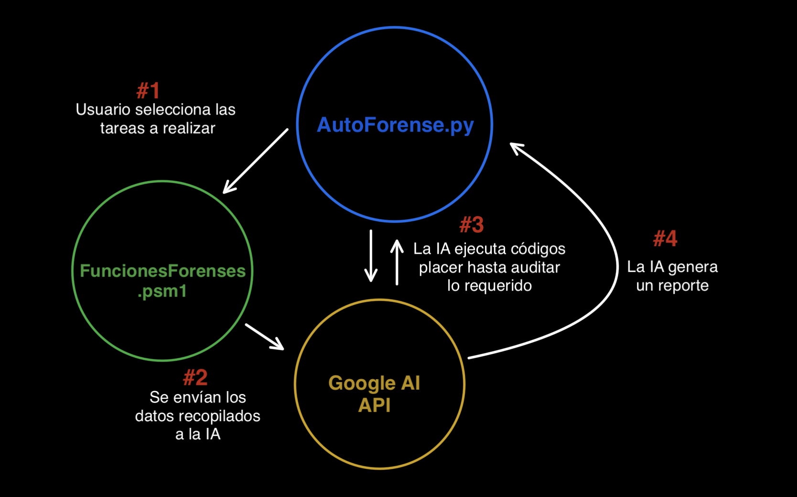

# AutoForense
Automatización Inteligente de Análisis Forense en Sistemas Windows.

## Descripción general del proyecto:
AutoForense es una herramienta desarrollada en PowerShell que permite automatizar tareas forenses dentro de sistemas Windows. El usuario puede seleccionar distintas funciones, como la extracción de eventos relevantes, la correlación de procesos activos con conexiones de red y la investigación de direcciones IP remotas. Los datos recolectados se envían a una IA (por ejemplo, Google AI) para su análisis automatizado, con el fin de auditar el sistema, detectar comportamientos sospechosos y generar un reporte final detallado.

## Estructura del proyecto
```text
/
│
├── src/
│   ├── AutoForense.py           # Código principal del proyecto (interfaz de usuario)
│   ├── FuncionesForenses.psm1   # Funciones de investigación forense (módulo PowerShell)
│   ├── PowershellHelper.py      # Helper para ejecutar funciones PowerShell desde Python
│   ├── AIAnalyzer.py            # Módulo de análisis con IA (Google AI/Gemini)
│   ├── PDFGenerator.py          # Generador de reportes en PDF
│   ├── Prompt.txt               # Prompt del sistema para la IA
│   └── reportes/                # Directorio de reportes generados (PDFs)
│
├── docs/
│   ├── ai_plan.md               # Plan de desarrollo y arquitectura del sistema
│   ├── diagrama.png             # Diagrama del flujo de trabajo del programa
│   └── README.md                # Archivo de documentación adicional
│
├── ejemplos/                                    # Ejemplos de uso y resultados de salida
│   ├── eventos_sospechosos_ejemplo.csv          # Ejemplo de eventos sospechosos extraídos
│   ├── procesos_sin_firma_ejemplo.csv           # Ejemplo de procesos sin firma digital
│   ├── reporte_procesos_internet_ejemplo.csv    # Ejemplo de procesos con conexión a red
│   ├── reporte_forense_consolidado_ejemplo.pdf  # Ejemplo de reporte final
│   └── README.md                                # Documentación de ejemplos
│
├── .gitignore                     # Archivos ignorados por git
├── ejecutar_autoforense.bat       # Script de ejecución rápida (Windows)
├── AutoForense_Presentacion.pptx  # Presentación del proyecto
├── requirements.txt               # Dependencias del proyecto (Python)
└── README.md                      # Archivo con la información principal del programa 
```

## Propósitos
- **AutoForense.py** - Captura las tareas a revisar que seleccione el usuario.
- **FuncionesForenses.psm1** - Recopila datos forenses del sistema Windows.
- **AIAnalyzer.py** - Envía los datos recopilados a la Inteligencia Artificial (Google AI/Gemini).
- **PDFGenerator.py** - La IA analiza los datos y genera un reporte detallado en formato PDF.


## Instalación y Configuración

### Requisitos
- Python 3.8 o superior
- PowerShell 5.1 o superior (incluido en Windows 10/11)
- API Key de Google AI (para funciones de IA)

### Instalación

1. **Instalar dependencias:**
```bash
pip install -r requirements.txt
```

2. **Configurar API Key de Google AI:**
   - Obtén tu API key en: https://makersuite.google.com/app/apikey
   - Crea un archivo `.env` en la raíz del proyecto:
   ```
   GOOGLE_API_KEY=tu_api_key_aqui
   ```

3. **Ejecutar el programa:**

**Windows (Recomendado):**
```bash
# Doble click en ejecutar_autoforense.bat
# O desde PowerShell/CMD como administrador:
.\ejecutar_autoforense.bat
```

**O manualmente:**
```bash
cd src
python AutoForense.py
```

> 💡 **Nota:** AutoForense ahora verifica e instala automáticamente las dependencias faltantes al iniciar.

📖 **Documentación adicional:**
- [Plan de Desarrollo](docs/ai_plan.md)
- Ejemplos de salida en carpeta `ejemplos/`

## Funcionalidades

### Modo Básico (sin IA)
1. **Get-SuspiciousEvents** - Extrae eventos sospechosos del Visor de eventos de Windows
2. **Get-InternetProcesses** - Correlaciona procesos activos con conexiones de red
3. **Get-UnsignedProcesses** - Detecta procesos sin firma digital válida

### Modo con IA (requiere API key)
4. **Análisis Forense con IA** - Ejecuta una tarea específica y la analiza con IA, generando reporte PDF
5. **Análisis Forense Completo** - Ejecuta todas las tareas, análisis consolidado y genera reporte PDF completo

## Diagrama del flujo de trabajo del programa

 
## Declaracion legal

AutoForense se proporciona “tal cual”, sin garantías de ningún tipo. Su uso es bajo su exclusiva responsabilidad. Ni el autor ni los distribuidores serán responsables por daños directos, indirectos, incidentales, consecuentes o de cualquier otra índole derivados del uso o mal uso del software. AutoForense no sustituye asesoría profesional forense ni legal; el usuario debe verificar el cumplimiento de todas las leyes y regulaciones aplicables. Al instalar o usar AutoForense, usted acepta mantener indemnes a sus desarrolladores y colaboradores frente a cualquier reclamación o responsabilidad.

Este proyecto se desarrollará exclusivamente con datos sintéticos o simulados. No se utilizarán datos reales, credenciales privadas ni información sensible. Todos los experimentos se ejecutarán en entornos controlados. El equipo se compromete a documentar cualquier riesgo ético y aplicar medidas de mitigación adecuadas.
