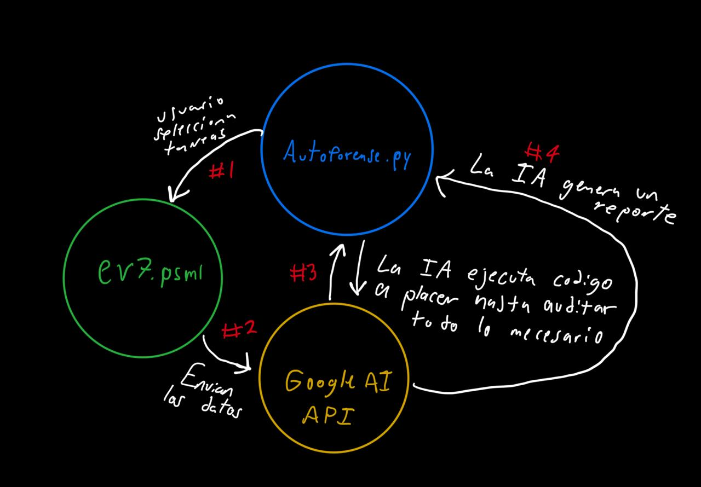

# AutoForense

**Nombre representativo que refleje el enfoque general:**
Automatización Inteligente de Análisis Forense en Sistemas Windows

## Descripción general del proyecto:
AutoForense es una herramienta desarrollada en PowerShell que permite automatizar tareas forenses dentro de sistemas Windows. El usuario puede seleccionar distintas funciones, como la extracción de eventos relevantes, la correlación de procesos activos con conexiones de red y la investigación de direcciones IP remotas. Los datos recolectados se envían a una IA (por ejemplo, Google AI) para su análisis automatizado, con el fin de auditar el sistema, detectar comportamientos sospechosos y generar un reporte final detallado.

## Estrucrura del proyecto
```text
/
│
├── src/
│   ├── AutoForense.py          # Codigo principal del proyecto
│   ├── FuncionesForenses.psm1  # Funciones de investigacion forense
│   └── Prompt.txt              # Prompt del sistema
│
├── docs/
│   ├── diagrama.jpg            # Diagrama del flujo de trabajo del programa
│   └── README.md               # Archivo de documentacion 
│
├── ejemplos/                   # Resultados de la salida del programa 
│
└── README.md                   # Archivo con la informacion principal del programa 
```

## Propositos

### FuncionesForenses.psm1
- **FuncionesForenses.psm1**: Módulo de powershell que contiene funciones para análisis forense
  - `Get-SuspiciousEvents`: Extrae eventos sospechosos del Visor de eventos de Windows
  - `Get-InternetProcesses`: Correlaciona procesos activos con conexiones de red
  - `Get-UnsignedProcesses`: Detecta procesos sin firma digital válida
  - `Get-SuspiciousInternetProcesses`: Investiga direcciones IP remotas usando AbuseIPDB API
  - `Get-FullForensicAnalysis`: Ejecuta un análisis forense completo combinando todas las funciones

## Diagrama del flujo de trabajo del programa

 
## Declaracion legal
 
Este proyecto se desarrollará exclusivamente con datos sintéticos o simulados. No se utilizarán datos reales, credenciales privadas ni información sensible. Todos los experimentos se ejecutarán en entornos controlados.  
El equipo se compromete a documentar cualquier riesgo ético y aplicar medidas de mitigación adecuadas
